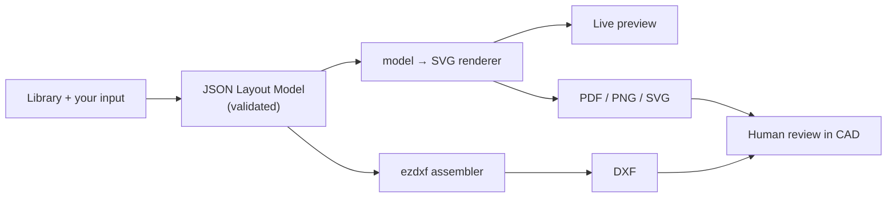

<h1 align="center">Cabinet Layout Generator</h1>

<p align="center">
  <strong>Lay out a control-cabinet back-plate in the browser — and export a real DXF that opens clean in GstarCAD.</strong>
</p>

<p align="center">
  Panel-shop engineers draw the same cabinet back-plates by hand, over and over — every terminal, duct
  and clearance placed by eye in CAD. This tool lets you drag real DIN-rail parts onto a mounting plate,
  set spacing to the millimetre, and generate fabrication-ready
  <b>DXF</b> · <b>PDF</b> · <b>PNG</b> · <b>SVG</b> with your company title block.
  <br/><em>You place. Deterministic code draws. You review in CAD.</em>
</p>

<p align="center">
  
  &nbsp;&nbsp;&nbsp;
  
</p>

<p align="center">
  <sub><em>Left: the live editor drawing. Right: the same model on an A3 sheet with title block, scale and
  row dimensions — both from <b>one JSON model</b>, no redrawing.</em></sub>
</p>

<p align="center">
  
  
  
  
  
  
</p>

<p align="center">
  <sub>The v2 (multi-user) repo. The frozen single-user v1 lives at
  <a href="https://github.com/Taamrock04/cabinet-layout-generator">Taamrock04/cabinet-layout-generator</a>.</sub>
</p>

---

## ⚡ Highlights

- 🚫 **Never guesses.** Every line, size and part is *exactly* your validated input — unknowns are flagged for confirmation, never silently filled.
- 🧩 **One model, three renderers that can't drift.** The canvas, the PDF/PNG/SVG exports, and the DXF all derive from a single JSON model — so what you see is what ships.
- 📐 **Real CAD output.** DXF with proper layers and a **named block per part** (CAD *Count Block*-able), plus plot-ready **"A3 SHEET"** and **"BOM"** layout tabs. Opens clean in **GstarCAD 2020**.
- 🏢 **Your title block, 1:1.** PDF/PNG drawing sheets reproduce the real shop template to the millimetre — and render **real device linework** from your uploaded DXFs, not bare rectangles. **Thai** titles supported.
- 👥 **Team-ready.** Cloud projects in shared folders, revision history, an audit trail, a shared parts catalog, and revocable read-only **share links**.
- 🆓 **Free & portable, every layer.** Layouts are JSON, equipment is raw DXF, hosting is all free-tier — nothing traps the engineer if a service changes.

---

## 🎯 The one rule

Most "AI CAD" tools guess. This one refuses to.

> **The tool never invents geometry, connectivity, or part data. It only structures and interprets your
> input. Deterministic code draws every line. A human reviews the result in CAD.**

A confidently-wrong terminal or clearance ships to a panel shop and costs real money — so unknown values
are **flagged for human confirmation, never filled in**. (AI is socketed but **off**; when enabled it may
only structure messy input into the validated schema — it never emits a coordinate.)

---

## 🧩 What you can do

**Place & arrange**
- Upload your own equipment DXFs into a **team-shared parts catalog** — measured on upload, DIN-rail datum read from the DXF origin, BOM fields captured, organised into shop categories.
- Resize equipment only by **typed millimetres**, never free-drag (a real panel part has one true size). Rotate 0/90/180/270° or arbitrary — spacing uses the rotated bounding box.
- **CAD-style selection:** marquee window/crossing sweeps (L→R / R→L), Shift-click, **Select row**, Ctrl+A — then nudge with arrow keys. Snap to the part's **DIN-rail line** with the 0.1 mm gap. Full undo/redo.

**Sets, ducts & accessories**
- **Add a set** — N identical parts, rail-aligned, **auto-numbered in place** (`B101…B112`) with optional **start/end caps** (end covers); explode later for singles. **⇤⇥ Insert beside** any part and the row **shifts open automatically**.
- **Wire ducts** snap **exactly onto any of the 4 plate borders**; row ducts **auto-span between the side ducts** (one-click **Fit width** re-spans).
- **Label plates** lock to a stopper (move/rotate/delete as one, still count as two in the BOM). **Custom parts** — a blank device you size and name yourself, for anything without a CAD file yet.

**Rows & validation**
- Rows auto-detect between ducts, each **dimensioned in the right margin**; click a dimension to edit, **Pack** from the left duct, **center** devices vertically.
- Overlap, too-tight clearance and plate-overflow are **flagged with a human-readable message** — never auto-cropped or silently moved.

**Export — all from the one model**
- **PDF / PNG** — real drawing sheets: frame, zone grid, and the company **title block matched 1:1** from the shop template (blank fields stay blank; the computed scale prints in the SCALE cell).
- **DXF** — layers `DUCT`/`EQUIP`/`TEXT`/`GROUND`, 1:1 or 1:100, monochrome; every part a named block `EQ_<key>`, plus the **"A3 SHEET"** and **"BOM"** paper-space tabs.
- **BOM** in shop format (ITEM NO. with `B101-B112` ranges · DESCRIPTION · MANUFACTURER · MODEL · QTY, plus manual rows) — as **CSV**, a framed **PDF sheet**, and the DXF tab.

**Team & sharing**
- Email-allowlist sign-in; **cloud projects in shared folders** with "saved by who/when", a stale-save conflict guard, **revision history** (restore the last ~20), an **audit log**, crash-safe drafts, and nightly backups.
- A revocable read-only **share link** (view + PDF/PNG, no sign-in) and a **portable bundle** ZIP (layout JSON + every referenced equipment DXF).
- **Degrades gracefully:** no cloud → local JSON save/open; DXF service asleep → PDF/PNG/SVG still work.

---

## 🔭 How it works

One JSON model is the single source of truth. The canvas is only a view — every export re-renders from
the model, so what you see is what you get.



- **One renderer** (`model → SVG`) feeds the live preview *and* the PDF/PNG/SVG exports — they can't drift.
- **One coordinate transform** flips the editor's top-left origin to DXF's bottom-left, in a single place.
- **Pure, unit-tested core** — re-flow, packing, bbox/rotation math and the transform have no UI dependency (135 web tests + 4 service harnesses in CI).

---

## 🚀 Quick start (local)

```bash
# 1) the editor — everything except DXF works with no backend
cd web
npm install
npm run dev            # → http://localhost:5180

# 2) optional: the DXF upload/export service (only needed for DXF)
cd service
python -m venv .venv
.venv\Scripts\activate          # Windows  (macOS/Linux: source .venv/bin/activate)
pip install -r requirements.txt
uvicorn app:app --port 8000
```

With no Supabase env it runs in **local mode** (full editor + JSON save/open, no sign-in). Full local
setup: **[RUNNING.md](RUNNING.md)** · deploy (Cloudflare Pages + Render + Supabase):
**[DEPLOY.md](DEPLOY.md)** + **[docs/PHASE2_SETUP.md](docs/PHASE2_SETUP.md)**.

> **New to the editor?** Click **? Guide** in the toolbar (or open `/guide.html`) for an illustrated
> walkthrough of every feature.

---

## 🛠 Tech stack

- ⚛️ **Editor** — React 19 + Vite + TypeScript, Fabric.js v7 canvas; Vitest for the pure model/render core.
- 🐍 **DXF service** — Python + FastAPI + ezdxf 1.4.4; stateless (`upload · export · block · health`), JWT-guarded and **fail-closed**.
- 🗄️ **Cloud** — Supabase (auth + Postgres/RLS + Storage) · Cloudflare Pages (frontend) · Render (service) — all free-tier.
- 🧱 **Free & portable** — layouts persist as JSON, equipment as raw DXF; anti-lock-in on every layer.

## 🗂 Project layout

```
web/        React (Vite) editor — the model, validation, the model→SVG renderer, the canvas UI
  src/model/    types, geometry, validate, rows, sets, insert, marquee, bom, sheet, bomsheet,
                bundle…  (pure, unit-tested)
  src/render/   toSvg + page/BOM-sheet composers + embedSvg (real part linework) — THE single renderer
  src/editor/   Fabric.js canvas binding + Toolbar / LibrarySidebar / PropertiesPanel / dialogs
  src/store/    cloud projects (folders/revisions/audit) · useCloudProjects hook · shared library · drafts · local JSON
  src/share/    read-only share-link viewer (?share=<token>)
service/    Python ezdxf service — upload (measure+retain) · export (assemble .dxf) · block (bundle) · health
supabase/   schema.sql — idempotent DB schema + RLS (allowlist, projects, revisions, folders, library,
            share tokens, audit events)
docs/       WORKFLOW · REFERENCE (palette/tree/stack) · RISK_REVIEW · SECURITY_HARDENING · PHASE2_SETUP · planning
```

## 📦 Project status

**All phases shipped and in real use**, deployed on **Cloudflare Pages + Render + Supabase** (free-tier)
and twice security-reviewed (posture ~9/10). The AI socket stays off. Remaining backlog: custom domain +
OAuth hardening (waits on the final domain).

Docs: [PHASE2_SETUP](docs/PHASE2_SETUP.md) (provisioning) · [DEPLOY](DEPLOY.md) · [SECURITY_HARDENING](docs/SECURITY_HARDENING.md) · [WORKFLOW](docs/WORKFLOW.md) · [ROADMAP](ROADMAP.md) · [CHANGELOG](CHANGELOG.md).
